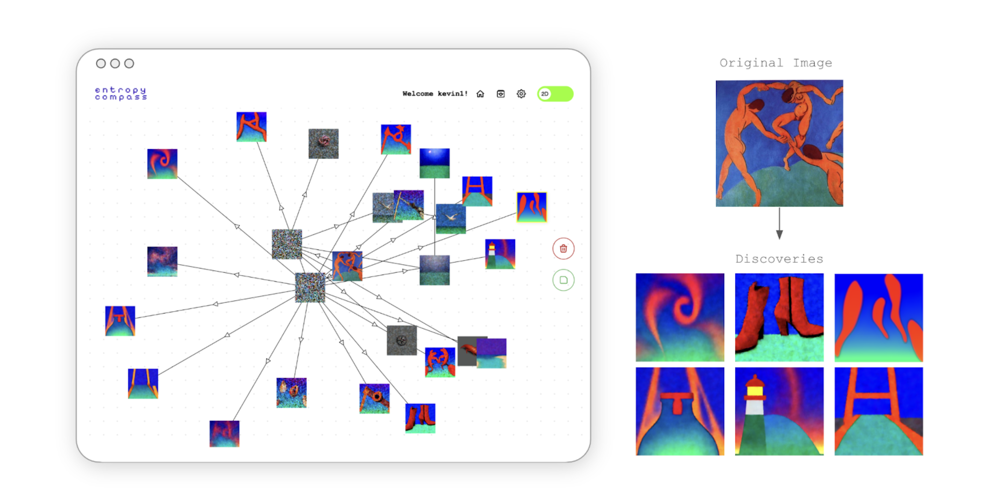

# Entropy Compass!!!

## Latent space navigation via diffusion-based image generation and integrated prompt steering

App built on Vue.js, Express.js, MongoDB, & AUTOMATIC1111

## Running Locally

`npm install`

Using two seperate, dedicated terminals:

Run `npm run dev:server` to start the backend server.
This will automatically restart the server code if you make changes to it.
In active server development, we recommend you run `npm start:server`.

Run `npm run dev:client` to start the client server.
Changes to the client code should automatically recompile and hot-reload without needing to restart the client server.
